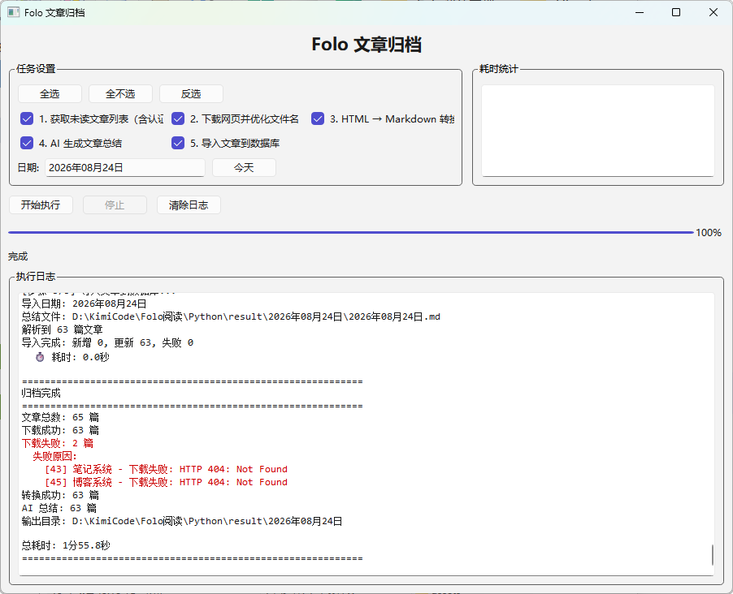

<p align="center">
  <h1 align="center">📥 Folo 阅读归档</h1>
  <p align="center">自动归档 Folo 阅读中的未读文章：一键获取 → 下载 → Markdown 转换 → AI 摘要 → 全文检索</p>
</p>

<p align="center">
  
  
  
</p>

## ✨ 特性

- **一键归档**：CLI 或 GUI 串行执行 5 个步骤，断点续跑，随时停止
- **智能识别**：策略模式自动识别 24 种来源（少数派、虎嗅、36氪、阮一峰等），按来源提取正文
- **AI 摘要**：DeepSeek API 生成通俗摘要，写入文章顶部（Obsidian abstract 语法）
- **全文检索**：文章与关键词入 SQLite，支持按关键词查询历史文章
- **本地化图片**：文章图片自动下载到本地，不依赖外链
- **跨日聚类**：AI 分析多日文章的主题关联与时间线
- **无控制台 GUI**：`pythonw` 启动，日志/进度/耗时全部可视化，失败原因红色高亮

## 🖥 截图



## 📦 安装

### 环境要求

- Python 3.10+
- Node.js v18+（获取文章列表依赖 `folocli`）
- Folo CLI 已登录：`npx folocli@latest login`

### 步骤

```bash
# 1. 克隆仓库
git clone https://github.com/ZerosZhang/FoloArchive.git
cd folo-archive

# 2. 创建虚拟环境并安装依赖
python -m venv .venv
.venv/Scripts/pip install -r requirements.txt    # Windows
# .venv/bin/pip install -r requirements.txt      # Linux/macOS

# 3. 配置 DeepSeek API
cp src/config.example.json src/config.json
# 编辑 src/config.json 填入 api_key
```

## 🚀 使用

### GUI（推荐）

```bash
.venv/Scripts/pythonw.exe src/archive_gui.py   # Windows
# 或双击 启动GUI.bat
```

勾选要执行的步骤，选择日期，点击「开始执行」。

### CLI

```bash
.venv/Scripts/python.exe src/archive.py                # 完整执行 5 个步骤
.venv/Scripts/python.exe src/archive.py --start-step 4 # 从第 4 步断点续跑
.venv/Scripts/python.exe src/archive.py --only-step 3  # 仅执行转换步骤
.venv/Scripts/python.exe src/archive.py --date "2026年07月07日"
```

## 🔄 工作原理

```
获取未读列表 → 下载网页 → HTML 转 Markdown → AI 摘要 → 导入数据库
    │             │              │              │            │
 folo_export   save_webpages   html_to_md    summarize_md  import_to_db
（result/temp_data） （result/日期/） （+assets/图片）  （abstract 块）  （SQLite）
```

- 文章保存为 `「来源」标题.md`，Obsidian 可直接索引
- 每日自动生成按来源分组的总结文件 `YYYY年MM月DD日.md`
- 支持 24 种来源解析策略，详见 [doc/src/strategies.md](doc/src/strategies.md)

## 📚 文档

| 模块 | 文档 |
|------|------|
| 全部模块说明 | [doc/src/](doc/src/) |
| 来源策略 | [doc/src/strategies.md](doc/src/strategies.md) |
| 核心流程 | [doc/src/archive_core.md](doc/src/archive_core.md) |
| GUI | [doc/src/archive_gui.md](doc/src/archive_gui.md) |

## 🧩 支持的来源

碎言、少数派、小众软件、异次元软件世界、阮一峰的网络日志、seangoedecke.com、Matthias Endler、偷懒爱好者周刊、龙爪槐守望者、橘鸦AI早报、宝玉的博客、土猛的员外、36氪、开源中国、423Down、Product Hunt、潮流周刊、Hexo 博客、HelloGitHub、寒流の编程笔记、虎嗅、子舒的博客、莫比乌斯、王志勇-和平海底

## 🛠 技术栈

- Python 3.10+（标准库为主）
- PySide6（GUI）
- DeepSeek API（AI 摘要 / 主题聚类）
- SQLite（文章索引与检索）
- Node.js `folocli`（获取 Folo 未读列表）

## 📄 许可证

[MIT](LICENSE)

## 🙏 致谢

- [Folo](https://folo.cn) — 阅读工具与 CLI
