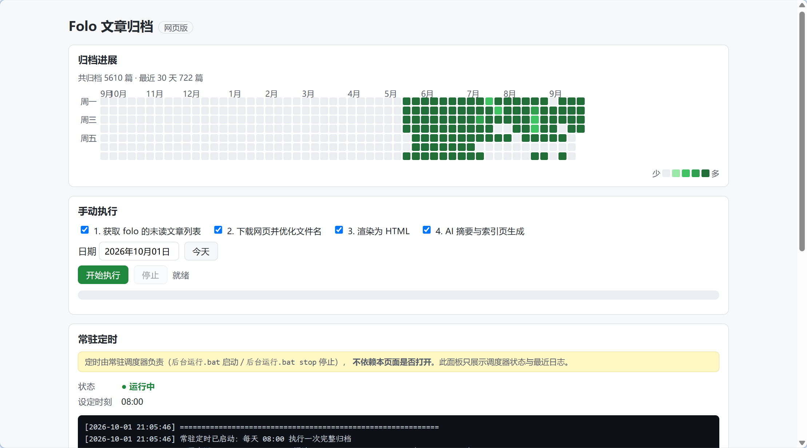

<p align="center">
  <h1 align="center">📥 Folo 阅读归档</h1>
  <p align="center">自动归档 Folo 阅读中的未读文章：一键获取 → 下载 → 渲染干净 HTML → AI 摘要</p>
</p>

<p align="center">
  
  
  
</p>

## 📖 背景

### Folo 是什么

[Folo](https://folo.cn)（Follow 的桌面客户端）是一个新一代信息聚合阅读工具：它把传统 RSS 订阅、AI 生成内容、论坛讨论、社交媒体动态统一到同一个订阅流中。你在 Folo 里添加感兴趣的来源（科技博客、行业资讯、个人周刊……），它会持续抓取并推送到你的"未读"列表。

### 这个项目做了什么

Folo 适合**快速浏览**，但阅读之外的需求它并不负责：文章链接会失效、网站会改版、内容会被删除。本项目把你标记为未读的长文**完整归档到本地**——自动下载网页、渲染成干净、适合手机阅读的 HTML、把图片保存到本地，并用 AI 生成摘要。

### 为什么归档为本地 HTML

- **永久保存**：订阅源的内容随时可能下架或反爬，本地副本不依赖任何平台
- **随处可读**：归档产物是干净 HTML + 本地图片，任意浏览器直接打开；把 `result/` 整个同步到 NAS / 共享文件夹，就能在电脑、平板、手机上浏览（页面样式统一来自 `result/style.css` 一份文件）
- **从"刷"到"读"**：Folo 里的文章读完即忘，归档后可以随时回看历史文章
- **每日索引**：每天自动生成一个按来源分组的索引页，一眼看全当天都读了什么

## ✨ 特性

- **一键归档**：CLI 或网页版界面串行执行 4 个步骤，断点续跑，随时停止
- **智能识别**：策略模式自动识别 22 种来源（少数派、36氪、阮一峰等），按来源提取正文
- **干净 HTML 输出**：剥离脚本与广告，套响应式模板，手机端可读；HTML 只放内容，样式就是 `result/style.css` 一份文件（改一处，所有页面立刻变）；含每日索引页
- **AI 摘要**：DeepSeek API 生成通俗摘要，注入文章页的摘要区块
- **本地化图片**：文章图片自动下载到 `assets/`，不依赖外链
- **本地网页版界面**：只用标准库的本地 HTTP 服务（Windows Server 2016 也能跑），浏览器打开即可操作与查看实时日志、进度、耗时、阅读状态日历与每日定时状态

## 🖥 截图



## 📦 安装

### 环境要求

- Python 3.10+
- Node.js v24+（获取文章列表依赖 `folocli`；v24 的 `NODE_USE_ENV_PROXY` 才能让 fetch 走系统代理）
- Folo CLI 已登录：`npx folocli@latest login`

### 步骤

```bash
# 1. 克隆仓库
git clone https://github.com/ZerosZhang/FoloArchive.git
cd FoloArchive

# 2. 创建虚拟环境并安装依赖
python -m venv .venv
.venv/Scripts/pip install -r requirements.txt    # Windows
# .venv/bin/pip install -r requirements.txt      # Linux/macOS

# 3. 配置 DeepSeek API
cp src/config.example.json src/config.json
# 编辑 src/config.json 填入 api_key
```

`config.json` 还可选配 `schedule`（每日定时）与 `mail`（失败邮件）两段，见 `src/config.example.json`。

## 🚀 使用

### 桌面小窗口（推荐，无终端黑框）

双击 `启动Folo.bat`，弹出一个只有三个按钮的小窗口：**今日归档 / 打开 web 页面 / 退出服务**。窗口不显示日志，进度与日志都在网页版界面里看。

- 用 `pythonw.exe` 启动，不会留下控制台窗口
- **关闭窗口不会退出**：窗口收进系统托盘继续后台跑（每日定时照常生效），右键托盘图标可「打开主窗口 / 今日归档 / 退出」，双击图标唤回窗口
- 要彻底退出，用托盘右键的「退出」或窗口里的「退出服务」按钮

> 需要 Python 自带 `tkinter`（python.org 安装程序默认勾选「tcl/tk and IDLE」）。若缺失，可改用下面的网页版模式，或重跑安装程序 → Modify → 勾选后重建 `.venv`。

```bash
.venv/Scripts/pythonw.exe src/gui.py           # 等价于双击 启动Folo.bat
.venv/Scripts/python.exe  src/gui.py --port 9000   # 带控制台，便于排查
```

### 网页版界面（无需 tkinter / 服务器适用）

```bash
.venv/Scripts/python.exe src/webui.py          # 默认 127.0.0.1:8765，自动打开浏览器
# 或双击 启动Web界面.bat（控制台模式，Ctrl+C 退出）
```

- 勾选要执行的步骤，选择日期，点击「开始执行」，页面实时显示日志、进度与各步骤耗时
- 内置「阅读状态日历」（原热力图）：格子按天三态显示——灰=无归档、绿=未读、蓝=已读；鼠标悬停看日期与篇数，单击在新标签页打开当天总览并标记为已读，Shift/Alt+单击只切换已读状态（合并 `result/` 与 `result/归档/`）。并展示定时归档的运行状态
- 归档完成后，若存在失败项且已配置 `mail` 段，会发送失败邮件通知
- 网页版内置每日定时（`config.json` 的 `schedule` 段），一个进程即可；也可用 `python src/scheduler.py` 独立运行（两者互斥，不会重复）。加 `--no-schedule` 可关闭内建定时

### CLI

```bash
.venv/Scripts/python.exe src/archive.py                # 完整执行 4 个步骤
.venv/Scripts/python.exe src/archive.py --start-step 4 # 从第 4 步断点续跑
.venv/Scripts/python.exe src/archive.py --only-step 3  # 仅执行渲染步骤
.venv/Scripts/python.exe src/archive.py --date "2026年07月07日"
```

## 🔄 工作原理

```
获取未读列表 → 下载原始 HTML → 渲染干净 HTML → AI 摘要 + 索引页
    │              │                │                │
 folo_export   save_webpages    render_html       summarize
（result/temp_data）（temp_data/raw/日期）（result/日期/*.html）（摘要区块 + 每日索引）
```

- 文章保存为 `「来源」标题.html`，图片本地化到同级 `assets/`
- 每日自动生成按来源分组的索引页 `YYYY年MM月DD日.html`
- 支持 22 种来源解析策略，详见 [doc/strategies.md](doc/strategies.md)

## 📚 文档

| 模块 | 文档 |
|------|------|
| 全部模块说明 | [doc/](doc/) |
| 来源策略 | [doc/strategies.md](doc/strategies.md) |
| 核心流程 | [doc/archive_core.md](doc/archive_core.md) |
| 桌面小窗口 | [doc/gui.md](doc/gui.md) |
| 系统托盘图标 | [doc/trayicon.md](doc/trayicon.md) |
| 网页版界面 | [doc/webui.md](doc/webui.md) |
| 热力图 | [doc/heatmap.md](doc/heatmap.md) |
| 失败邮件 | [doc/notify.md](doc/notify.md) |

## 🧩 支持的来源

碎言、少数派、小众软件、异次元软件世界、阮一峰的网络日志、seangoedecke.com、Matthias Endler、偷懒爱好者周刊、龙爪槐守望者、宝玉的博客、土猛的员外、36氪、423Down、潮流周刊、Hexo博客、HelloGithub - 精选开源项目、寒流の编程笔记、子舒的博客、莫比乌斯、王志勇-和平海底、独立开发变现周刊、Blog Yu Gao

## 🛠 技术栈

- Python 3.10+（标准库为主）
- 桌面小窗口（标准库 `tkinter`，需 Python 安装时保留 tcl/tk）
- 本地网页版界面（标准库 `http.server`，零第三方依赖）
- DeepSeek API（AI 摘要）
- Node.js `folocli`（获取 Folo 未读列表）

## 📄 许可证

[MIT](LICENSE)

## 🙏 致谢

- [Folo](https://folo.cn) — 阅读工具与 CLI
